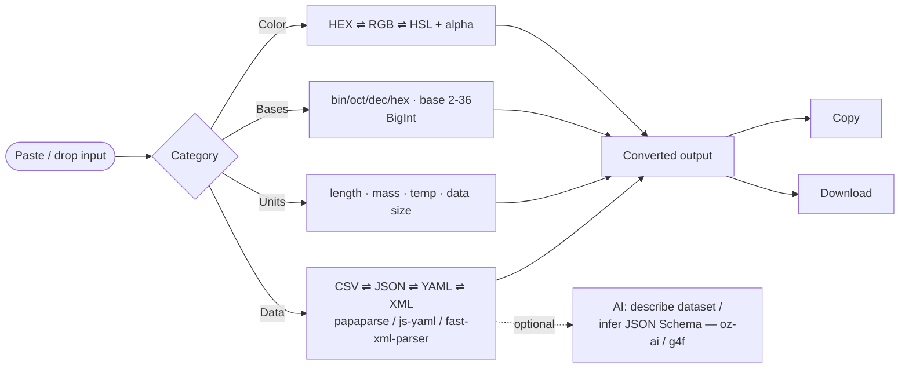

# oriz Convert

> A universal converter that runs entirely in your browser — CSV/JSON/YAML/XML, units, number bases, and color formats. No upload, no signup.

[](./LICENSE)
[](https://github.com/chirag127/oriz-convert/stargazers)
[](https://github.com/chirag127/oriz-convert/commits/main)
[](https://github.com/chirag127/oriz-convert/actions/workflows/deploy.yml)
[](https://astro.build)

## What it is / why it exists

Everyday conversions — reshape a CSV into JSON, read a config in YAML instead of XML, work out what a byte value is in hex, translate a HEX color to HSL — usually mean juggling a handful of single-purpose online tools, most of which want your data on their server. **oriz Convert** puts the common ones in a single browser tab and does every conversion locally: nothing is uploaded, and the only network call is the optional AI insight you trigger yourself. One place, no tracking, no paste-into-a-stranger's-server.

## Links

- **Live app:** https://convert.oriz.in
- **Info / landing page:** https://chirag127.github.io/oriz-convert/
- **Repo:** https://github.com/chirag127/oriz-convert
- **llms.txt:** https://convert.oriz.in/llms.txt

⭐ If this is useful, please **star the repo** — it helps others find it.

## How it works



All conversion runs in-browser; the heavy parsers are dynamically imported per feature so first paint stays instant. The AI insight is optional polish — core conversion works even if every provider is down.

## Features

- **Data formats** — CSV ⇌ JSON ⇌ YAML ⇌ XML in any direction. Paste or drag-drop a file; copy or download the result.
- **Units** — length, mass, temperature, and data size. One value converts to every unit in the category at once.
- **Number bases** — binary / octal / decimal / hex and any base 2–36, arbitrary-precision via BigInt, accepts `0x` / `0b` / `0o` prefixes.
- **Color** — HEX ⇌ RGB ⇌ HSL with alpha, live swatch, and native color picker.
- **AI insight (optional)** — describe a pasted dataset or infer a JSON Schema from it.
- **No upload, no signup, no analytics, free** — everything runs in-browser.

## Tech stack

- **[Astro](https://astro.build)** (static) — zero-JS-by-default shell
- **React 19** islands per converter
- **Tailwind CSS v4** via `@tailwindcss/vite`
- **[papaparse](https://www.papaparse.com/)** (CSV), **[js-yaml](https://github.com/nodeca/js-yaml)** (YAML), **[fast-xml-parser](https://github.com/NaturalIntelligence/fast-xml-parser)** (XML) — dynamically imported per feature
- **[@vite-pwa/astro](https://github.com/vite-pwa/astro)** — installable, offline-capable PWA
- **Shared `@chirag127/*` packages** — `oz-ai` (keyless client-side AI over g4f/gpt4free with multi-provider failover, no API key), `oz-chrome`, `oz-file`, `oz-tokens-base`
- **Fonts:** Fraunces + Inter + JetBrains Mono (variable, self-hosted via Fontsource)

## Repo structure

```
oriz-convert/
├── src/
│   ├── components/
│   │   ├── ConverterApp.tsx    # root island / tab shell
│   │   ├── Transmute.tsx       # shared convert surface
│   │   ├── DataConverter.tsx   # CSV/JSON/YAML/XML
│   │   ├── UnitConverter.tsx   # units
│   │   ├── BaseConverter.tsx   # number bases
│   │   └── ColorConverter.tsx  # color formats
│   ├── lib/
│   │   ├── dataformats.ts      # CSV/JSON/YAML/XML parse+serialize
│   │   ├── units.ts            # unit tables & conversion
│   │   ├── bases.ts            # BigInt base conversion
│   │   ├── color.ts            # HEX/RGB/HSL math
│   │   └── ai.ts               # optional AI insight (oz-ai)
│   ├── layouts/Base.astro
│   ├── pages/index.astro
│   └── styles/                 # app.css, theme.css
├── test/                       # vitest — bases, color, dataformats, units
├── public/                     # favicon, icons, screenshots, llms.txt, robots.txt
├── gh-info/                    # GitHub Pages info/landing page source
├── PWABUILDER.md               # Android/store packaging notes
└── .github/workflows/          # deploy.yml, gh-pages-info.yml
```

## Quick start

```bash
npm install          # Windows: append --legacy-peer-deps (pnpm skips @esbuild/win32-x64)
npm run dev          # local dev server
npm run build        # static build → dist/
npm test             # vitest — pure conversion logic
npm run deploy       # astro build && wrangler pages deploy (Cloudflare Pages)
```

## Configuration

**No configuration required.** This is a fully client-side tool. The optional AI insight works keyless via `@chirag127/oz-ai` (g4f multi-provider failover) — no API keys are needed or committed.

## PWA

oriz Convert is an installable PWA (`@vite-pwa/astro`) and works offline after first load. It can be packaged for the Play Store / app stores via [PWABuilder](https://www.pwabuilder.com) — see [`PWABUILDER.md`](./PWABUILDER.md).

## Screenshots

_Desktop and mobile screenshots live in [`public/screenshots/`](./public/screenshots/) and are wired into the PWA manifest._

## Part of the oriz family

oriz Convert is one of ~80 small, fast, client-side tools in the **oriz** family. See how the fleet is built and why at **https://blog.oriz.in**.

## Cost

**$0 on the Cloudflare free tier** — static hosting, no backend, no database.

## Contributing

Issues and PRs welcome. Keep every conversion client-side and dynamically import heavy parsers. Tests live in `test/` and run with `npm test`.

## License

[MIT](./LICENSE) © Chirag Singhal

## Author

Chirag Singhal · chirag@oriz.in

## Status & roadmap

Stable and in active use. Ideas: TOML/INI support, timestamp/epoch converter, more unit categories.

## Changelog

Conventional commits are the changelog.
